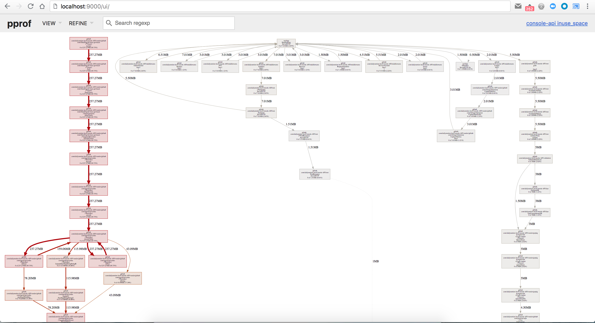
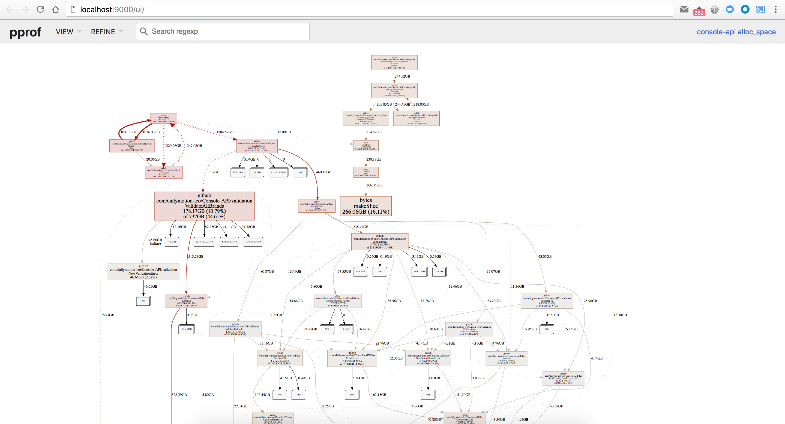
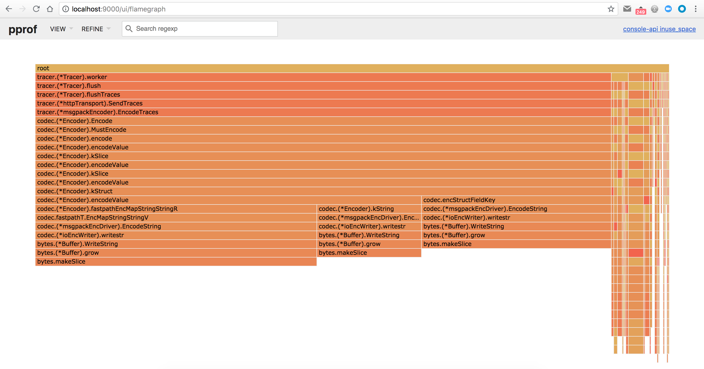

# Analyzing pprof profiles

[pprof](https://github.com/google/pprof) is a great tool to visualize and analyse profiling data - generated from the [pprof HTTP handler](../http-handlers/README.md).

While it is embedded in Go - as `go tool pprof` - you can install it as a standalone tool:

```
$ go get -u github.com/google/pprof
```

This will enable you to have the latest version of the tool.

There are many ways to use pprof, but the easiest one is to use it as an HTTP server, and use your favorite browser to interact with it:

```
$ pprof -http=:9000 /path/to/profile-file
```

Running this command will automatically open your default browser and point it to <http://localhost:9000/ui/>:



This is the default "graph" view of a heap profile. By default, heap profiles are based on the "inuse space", by you can display heap profiles based on different metrics, by using the `-sample_index` flag option with one of the following values:

- `inuse_space` (the default): displays in-use memory size
- `inuse_objects`: displays in-use object counts
- `alloc_space`: displays allocated memory size
- `alloc_objects`: displays allocated object counts

For example, the same heap profile, but displayed with different metrics (alloc space):



(you can see on the top right of the screen the metric used)

We can see that it's a very different graph, because instead of representing the memory used right now, it represents all the memory allocated since the application started. So we can switch from one to the other, based on what we're looking for.

But the graph view is not the only one - pprof has support for multiple views, that you can select on the top-left of the screen:

- `Top`: displays a sortable table of the top elements
- `Graph` (default view): a tree representation of the elements
- `Flame Graph`: a [flame graph](http://www.brendangregg.com/flamegraphs.html) representation of the elements
- `Peek`: a raw-text version of the `top` view
- `Source`: an extract of the source code around each element
- `Disassemble`: high-level sum of all the elements

The `Flame Graph` view is very good to have a good overview:



So far we analyzed a heap profile, but it work the same way for CPU profiles and goroutine profiles.

`pprof` also has a nice feature, that allows it to retrieve a profile file by itself from a remote HTTP server.

So instead of having to first collect the profile, and then feed it to `pprof` in 2 steps:

```
$ curl http://host:port/debug/pprof/heap > /tmp/heap.profile
$ pprof -http=:9000 /tmp/heap.profile
```

You can do it in 1 single step, by passing the profile URL to `pprof`:

```
$ pprof -http=:9000 http://host:port/debug/pprof/heap
```

and `pprof` will save the profile file in a directory defined by the `PPROF_TMPDIR` environment variable - which defaults to `$HOME/pprof`.

## Resources

- <https://mycodesmells.com/post/profiling-with-pprof>
- <https://artem.krylysov.com/blog/2017/03/13/profiling-and-optimizing-go-web-applications/>
- <https://jvns.ca/blog/2017/09/24/profiling-go-with-pprof/>
- <https://golang.org/doc/diagnostics.html>

## Next

You can now head over to the next section, on [analyzing execution traces](traces/README.md).
