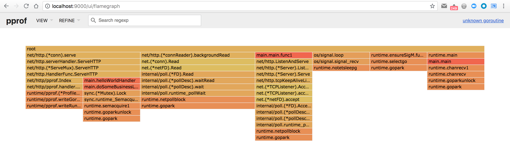
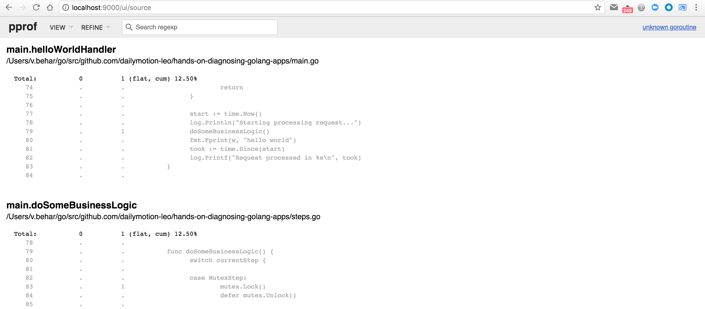

# Step 1

So, let's start with the first "bad" behaviour.

Make sure you've made a request to [/goto?step=1](http://localhost:6060/goto?step=1) to enable the first step:

```
$ curl http://localhost:6060/goto\?step\=1
switched to step 1
```

Because we don't know where to look, we can start by hitting the main endpoint of our HTTP server, by making an HTTP request on <http://localhost:6060/>. The first thing we notice, is that the server doesn't answer:

```
$ curl -iv http://localhost:6060/
*   Trying ::1...
* TCP_NODELAY set
* Connected to localhost (::1) port 6060 (#0)
> GET / HTTP/1.1
> Host: localhost:6060
> User-Agent: curl/7.54.0
> Accept: */*
>
```

and in the logs on the application, we can see that it started to process the request, but it never finished:

```
2018/07/12 15:03:44 Application started with PID 73825
2018/07/12 15:03:44 HTTP server started on :6060
2018/07/12 15:04:00 Starting processing request...
```

So, from the list of tools we just learned about, we could start by having a look at the list of running goroutines, to see what our application is doing. In theory, we should see a goroutine for our current request.

If we open the goroutines profile provided by the pprof endpoint at <http://localhost:6060/debug/pprof/goroutine?debug=2>, we can see a few goroutines, and among them:

```
goroutine 34 [semacquire]:
sync.runtime_SemacquireMutex(0x15c070c, 0xc4200b0000)
	/usr/local/opt/go/libexec/src/runtime/sema.go:71 +0x3d
sync.(*Mutex).Lock(0x15c0708)
	/usr/local/opt/go/libexec/src/sync/mutex.go:134 +0x108
main.doSomeBusinessLogic()
	/Users/v.behar/go/src/github.com/dailymotion-leo/golang-debug/steps.go:83 +0x88
main.helloWorldHandler(0x13eb4e0, 0xc4201ae000, 0xc4201a4000)
	/Users/v.behar/go/src/github.com/dailymotion-leo/golang-debug/main.go:79 +0xf7
net/http.HandlerFunc.ServeHTTP(0x13bd240, 0x13eb4e0, 0xc4201ae000, 0xc4201a4000)
	/usr/local/opt/go/libexec/src/net/http/server.go:1947 +0x44
net/http.(*ServeMux).ServeHTTP(0x15a2a00, 0x13eb4e0, 0xc4201ae000, 0xc4201a4000)
	/usr/local/opt/go/libexec/src/net/http/server.go:2337 +0x130
net/http.serverHandler.ServeHTTP(0xc420170000, 0x13eb4e0, 0xc4201ae000, 0xc4201a4000)
	/usr/local/opt/go/libexec/src/net/http/server.go:2694 +0xbc
net/http.(*conn).serve(0xc42019a000, 0x13eb7e0, 0xc420158040)
	/usr/local/opt/go/libexec/src/net/http/server.go:1830 +0x651
created by net/http.(*Server).Serve
	/usr/local/opt/go/libexec/src/net/http/server.go:2795 +0x27b
```

This one is the goroutine for our current HTTP request (we can see the `ServeHTTP` funcs). If we read the stack trace from bottom to top, we can see that we have an `helloWorldHandler` which is calling `doSomeBusinessLogic`, which in turn is locking a mutex. And that's where our goroutine is blocked: trying to acquire a lock on a mutex.

So most likely the issue is that somewhere else in the code, the same mutex has already been locked, but not released yet.

## Different tools we could have used

Here we used the pprof HTTP handler, but sometimes you might be debugging Go applications which doesn't have the pprof handlers registered, or doesn't have an HTTP server at all, or where the HTTP server doesn't answer at all.

The other tools we could have used to get the list of running goroutines:

### `SIGABRT` signal

Sending the `SIGABRT` (or `ABRT`) signal is another solution that will always work. By default, all Go applications will exit when receiving this signal, and will print the list of goroutines to `stderr`.

In our case, our application is running with PID `73825` (we can see that in the first line of the application logs), so we can send the signal with:

```
$ kill -s SIGABRT 73825
```

The only issue with this method of getting the list of goroutines, is that the application will be killed... and sometimes we would like to avoid that.

### Custom signal handling

If you are lucky, the faulty application might have a custom signal handling, and can print the list of goroutines when receiving a specific signal, without exiting. Our sample application supports just that, with the custom `SIGUSR1` (or `USR1`) signal:

```
$ kill -s SIGUSR1 73825
```

### Goroutine profile

If you want to understand what are doing the goroutines, but without having to kill the process, you can take a goroutine profile and analyze it with `pprof`.

Make sure you have a recent version of [pprof](https://github.com/google/pprof):

```
$ go get -u github.com/google/pprof
```

and then request a goroutine profile:

```
$ pprof -http=:9000 http://localhost:6060/debug/pprof/goroutine
```

It will automatically open your default browser and point it to <http://localhost:9000/ui/>. The default view is the **Graph** view, but I think that the **Flame Graph** view is easier to understand. You can select a different view by using the `View` dropdown on the top left of the UI, and select `Flame Graph` - or go to <http://localhost:9000/ui/flamegraph> directly:



In this view, we can see the "inversed stack trace" of the goroutines. We can see on the left the goroutines used to serve the HTTP requests:
- the left-most one serving the pprof request (used to generate the profile we are looking at)
- and next to it, another goroutine serving the `helloWorldHandler`, and which seems stuck on a mutex lock.

To dive deeper into it, we can select the **Source** view, and search for `helloWorldHandler`:



and we can clearly see that there is 1 goroutine stuck on the mutex lock.

### Core dump

Another solution to avoid killing the application: doing a core dump, with `gcore` for example. And then, analyzing it with a debugger, like `delve`.

A variant is to attach the debugger directly to the running application - which is what we will do now:

```
$ dlv attach 73825
Type 'help' for list of commands.
(dlv) goroutines
[9 goroutines]
  Goroutine 1 - User: ./go/src/github.com/dailymotion-leo/hands-on-debugging-golang-apps/main.go:43 main.main (0x12e1de3)
  Goroutine 2 - User: /usr/local/opt/go/libexec/src/runtime/proc.go:292 runtime.gopark (0x102e13a)
  Goroutine 3 - User: /usr/local/opt/go/libexec/src/runtime/proc.go:292 runtime.gopark (0x102e13a)
  Goroutine 4 - User: /usr/local/opt/go/libexec/src/runtime/sigqueue.go:139 os/signal.signal_recv (0x10429f7)
  Goroutine 5 - User: /usr/local/opt/go/libexec/src/runtime/netpoll.go:173 internal/poll.runtime_pollWait (0x1028807)
  Goroutine 6 - User: /usr/local/opt/go/libexec/src/runtime/proc.go:292 runtime.gopark (0x102e13a)
  Goroutine 18 - User: /usr/local/opt/go/libexec/src/runtime/proc.go:292 runtime.gopark (0x102e13a)
  Goroutine 36 - User: /usr/local/opt/go/libexec/src/runtime/sema.go:71 sync.runtime_SemacquireMutex (0x103e54d)
  Goroutine 37 - User: /usr/local/opt/go/libexec/src/runtime/netpoll.go:173 internal/poll.runtime_pollWait (0x1028807)
(dlv) goroutine 36
Switched from 0 to 36 (thread 22445724)
(dlv) stack
 0  0x000000000102e13a in runtime.gopark
    at /usr/local/opt/go/libexec/src/runtime/proc.go:292
 1  0x000000000102e1ee in runtime.goparkunlock
    at /usr/local/opt/go/libexec/src/runtime/proc.go:297
 2  0x000000000103e834 in runtime.semacquire1
    at /usr/local/opt/go/libexec/src/runtime/sema.go:144
 3  0x000000000103e54d in sync.runtime_SemacquireMutex
    at /usr/local/opt/go/libexec/src/runtime/sema.go:71
 4  0x00000000010624b8 in sync.(*Mutex).Lock
    at /usr/local/opt/go/libexec/src/sync/mutex.go:134
 5  0x00000000012e2a58 in main.doSomeBusinessLogic
    at ./go/src/github.com/dailymotion-leo/hands-on-debugging-golang-apps/steps.go:83
 6  0x00000000012e23a7 in main.helloWorldHandler
    at ./go/src/github.com/dailymotion-leo/hands-on-debugging-golang-apps/main.go:79
 7  0x000000000126d064 in net/http.HandlerFunc.ServeHTTP
    at /usr/local/opt/go/libexec/src/net/http/server.go:1947
 8  0x000000000126ecd0 in net/http.(*ServeMux).ServeHTTP
    at /usr/local/opt/go/libexec/src/net/http/server.go:2337
 9  0x000000000126fd0c in net/http.serverHandler.ServeHTTP
    at /usr/local/opt/go/libexec/src/net/http/server.go:2694
10  0x000000000126c081 in net/http.(*conn).serve
    at /usr/local/opt/go/libexec/src/net/http/server.go:1830
```

So here we attached to our running application, and then asked for the list of goroutines with the `goroutines` command.
We can see that `Goroutine 36` is blocked on `sync.runtime_SemacquireMutex` - which means that it is waiting for a lock.
We can inspect that goroutine in more details with the `goroutine 36` command, which will set the current context to that goroutine.
And then, we can display the stack trace for the current goroutine with the `stack` command. Which confirms that we are blocked on a mutex lock from our `helloWorldHandler`.

We can go even further, and show our source code: we know that the function trying to get the lock is `doSomeBusinessLogic`, which is the frame `5` here (it's the number at the beginning of the line...), so let's print the source code for this frame:

```
(dlv) frame 5 list
Goroutine 36 frame 5 at /Users/v.behar/go/src/github.com/dailymotion-leo/hands-on-debugging-golang-apps/steps.go:83 (PC: 0x12e2a58)
    78:
    79:	func doSomeBusinessLogic() {
    80:		switch currentStep {
    81:
    82:		case MutexStep:
=>  83:			mutex.Lock()
    84:			defer mutex.Unlock()
    85:
```
