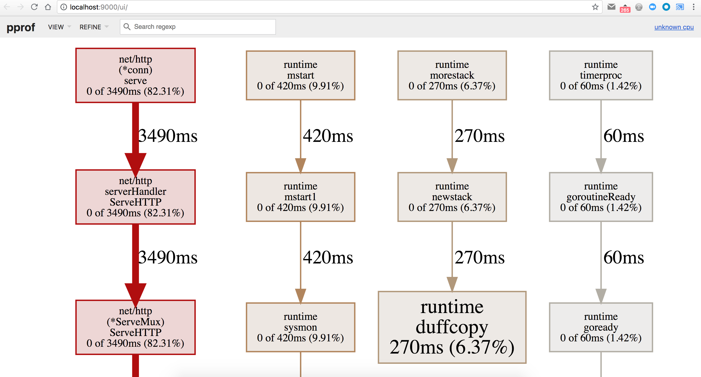
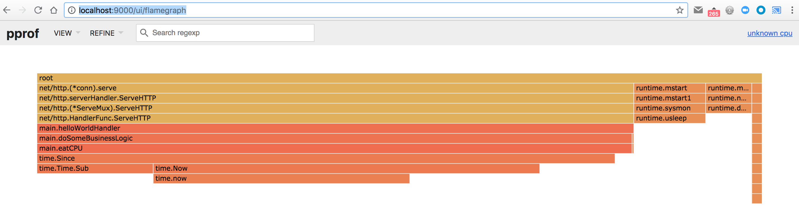
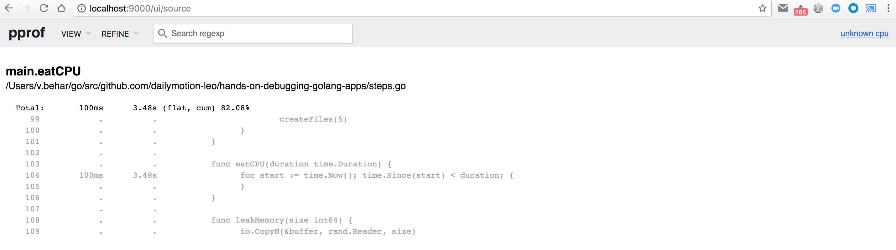
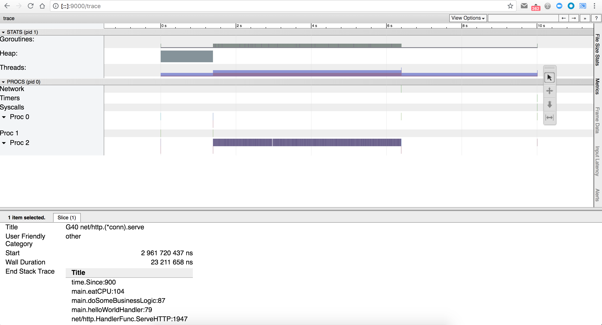

# Step 2

First, make sure you've made a request to [/goto?step=2](http://localhost:6060/goto?step=2) to enable the second step:

```
$ curl http://localhost:6060/goto\?step\=2
switched to step 2
```

Same as the first step, we don't know where to look, so we can start by hitting the main endpoint of our HTTP server, by making an HTTP request on <http://localhost:6060/>:

```
$ curl http://localhost:6060/
hello world
```

This time the endpoint answers, but it's very slow. If we look at the logs, we can see that it took around 5 seconds:

```
2018/07/12 15:03:44 Application started with PID 73825
2018/07/12 15:03:44 HTTP server started on :6060
2018/07/12 16:30:47 Starting processing request...
2018/07/12 16:30:52 Request processed in 5.000021848s
```

From the list of tools we now have in our toolbox, we know that if we want to investigate this kind of situation, we should take a CPU profile of our running application, and analyze it with `pprof`.

Make sure you have a recent version of [pprof](https://github.com/google/pprof):

```
$ go get -u github.com/google/pprof
```

and then request a 10 seconds CPU profile:

```
$ pprof -http=:9000 http://localhost:6060/debug/pprof/profile\?seconds\=10
```

Now you have a few seconds to make a new HTTP request with

```
$ curl http://localhost:6060/
```

(because we asked for a 10 seconds profile, and we know that the request takes 5 seconds... if the profile finished before the end of the request that's not a big deal, but if you didn't had time to make the request, then you should ask for a bigger profile)

After 10 seconds, pprof will automatically open your default browser and point it to <http://localhost:9000/ui/>



The default view is the **Graph** view, but I think that the **Flame Graph** view is easier to understand. You can switch view by using the `View` dropdown on the top left of the UI, and select `Flame Graph` - or go to <http://localhost:9000/ui/flamegraph> directly.



We can clearly see that most of the CPU time is spent in `doSomeBusinessLogic` function, and more specifically in the `eatCPU` function. Well, given the name of the function, I guess it's working pretty well ;-)

We can see that it's doing some time-related operations. If we now select the `Source` view - or go to <http://localhost:9000/ui/source> - we can see the affected source code directly, and if we search for the `eatCPU` func:



It's clear enough now that someone wants to eat CPU for a specific duration.

You can see how easy it is to get from the high level view to specific lines of code using the same UI.

## Different tools we could have used

We could also use a different tool to understand what is happening during those 5 seconds: the Go trace tool. First, we need to collect a trace with

```
$ curl http://localhost:6060/debug/pprof/trace\?seconds\=10 > /tmp/trace.out
```

Then, make a new HTTP request

```
$ curl http://localhost:6060/
```

and use the go trace tool to start a new webserver on port 9000 to analyze the trace:

```
$ go tool trace -http=:9000 /tmp/trace.out
```

It should automatically open your default browser and point it to <http://localhost:9000/>. If you click on the `View trace` link, you will see



We can see that we have a goroutine working for approximately 5 seconds, and if we click on one of the lines in the `PROCS` section in the bottom, we can see the stack trace for that specific sample, and we clearly see our `eatCPU` function, and the call to `time.Since`. It is not easy to see what is globally happening, but it's much more easy to go down to a specific sample.
