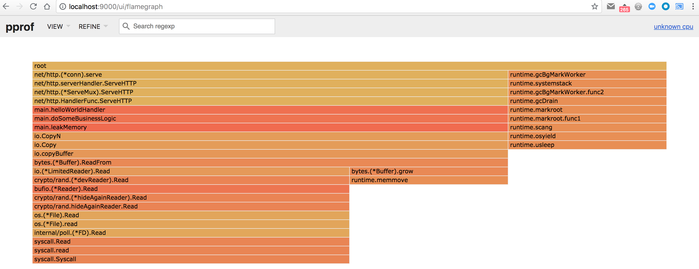
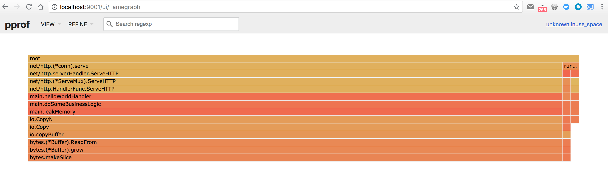
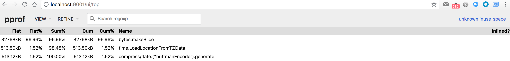
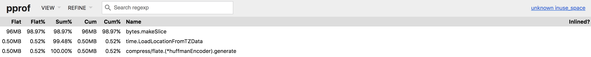
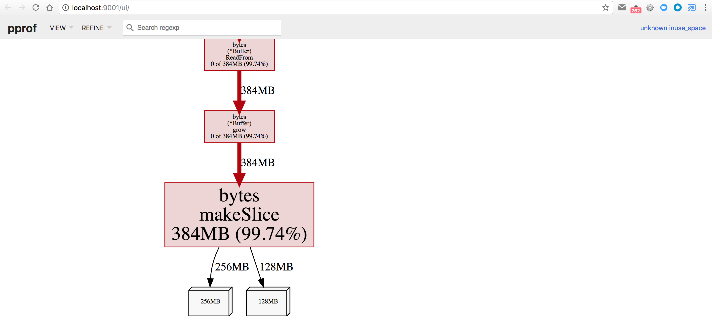
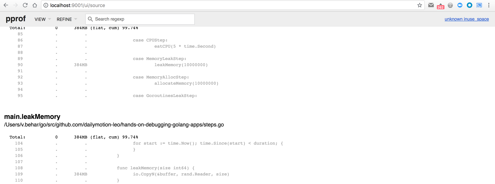
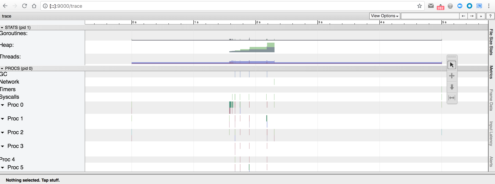
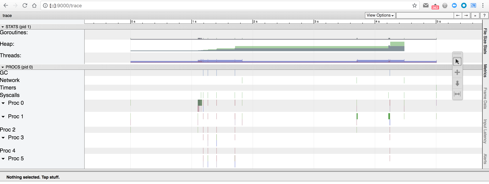

# Step 3

First, make sure you've made a request to [/goto?step=3](http://localhost:6060/goto?step=3) to enable the third step:

```
$ curl http://localhost:6060/goto\?step\=3
switched to step 3
```

Same as the other steps, we don't know where to look, so we can start by hitting the main endpoint of our HTTP server, by making an HTTP request on <http://localhost:6060/>:

```
$ curl http://localhost:6060/
hello world
```

This time the endpoint answers, slowly, but not as slow as in the step 2. If we look at the logs, we can see that it took a few hundred milliseconds (which is slower than expected):

```
2018/07/12 15:03:44 Application started with PID 73825
2018/07/12 15:03:44 HTTP server started on :6060
2018/07/12 16:30:47 Starting processing request...
2018/07/12 16:30:47 Request processed in 706.246536ms
```

We can use the same tool as for the step 2: pprof and a CPU profile. Start by requesting a 10 seconds CPU profile:

```
$ pprof -http=:9000 http://localhost:6060/debug/pprof/profile\?seconds\=10
```

And make a new HTTP request with

```
$ curl http://localhost:6060/
```

After 10 seconds, pprof will automatically open your default browser and point it to <http://localhost:9000/ui/>. Let's open our favorite `Flame Graph` view at <http://localhost:9000/ui/flamegraph>:



Once again, we can clearly see that most of the CPU time is spent in `doSomeBusinessLogic` function, and more specifically in the `leakMemory` function. Let's try not to be influenced by the function name, and see behind it: lots of io-related operations, and a bytes buffer that is growing.

So, it's memory-related. Let's see if a memory heap profile can help us dig dipper. We'll take a heap profile with

```
$ pprof -http=:9001 http://localhost:6060/debug/pprof/heap
```

It will start a new web server on port 9001, open your default browser and point it to <http://localhost:9001/ui/>. Let's open our favorite `Flame Graph` view at <http://localhost:9001/ui/flamegraph>:



This time, what you see in the flame graph is not the CPU time taken by each function, but the memory used by each one (at the time the profile was taken). The `bytes.makeSlice` is the lowest function in the stack that holds the data, so it must be responsible for all that memory allocation.

If we switch to the `Top` view at <http://localhost:9001/ui/top> we can see that it holds 32 MB of data:



Let's make a few more HTTP requests to <http://localhost:6060/>, and then take a new heap profile with

```
$ pprof -http=:9001 http://localhost:6060/debug/pprof/heap
```

If we open the `Top` view at <http://localhost:9001/ui/top> again, we can see that it now holds 96 MB of data:



This seems like a memory leak. Let's make a few more requests, take a new heap profile, and this time have a look at the `Graph` view at <http://localhost:9001/ui/>:



This time it's holding 384 MB of data, in 2 "objects" (most likely byte arrays) of 256 and 128 MB each, which are re-allocated when the buffer needs to grow.

Let's finish with a look at the `Source` view at <http://localhost:9001/ui/source>:



We are clearly copying data from a random generator reader to a shared buffer, and it seems like the data copied to the shared buffer is never cleared/reclaimed. Thus creating a memory leak.

## Different tools we could have used

### ps

Another way to look at it, is to use `ps` - using the PID of the application, which is printed in the application's logs:

```
$ ps l 73825
UID   PID  PPID CPU PRI NI       VSZ    RSS WCHAN  STAT   TT       TIME COMMAND
502 73825 76310   0  31  0 556619472   4284 -      S+   s005    0:00.01 ./hands-on-diagnosing-golang-apps
```

The interesting column to look at is the `RSS` one, which is the `Resident Set Size`. Here, it is `4284 KB`, just after the application startup.

Let's make a few requests, and have a look at the output of `ps` again:

```
$ ps l 73825
UID   PID  PPID CPU PRI NI       VSZ      RSS WCHAN  STAT   TT       TIME COMMAND
502 73825 76310   0  31  0 556626968   123888 -      S+   s005    0:03.65 ./hands-on-diagnosing-golang-apps
```

We can see that the RSS has grown to more than 120 MB. 

# go trace tool

Yet another way to look at it, is to collect a trace and analyze it with the go trace tool, as we did in the previous step. First, we need to collect a trace with

```
$ curl http://localhost:6060/debug/pprof/trace\?seconds\=5 > /tmp/trace.out
```

Then, make a new HTTP request

```
$ curl http://localhost:6060/
```

and use the go trace tool to start a new webserver on port 9000 to analyze the trace:

```
$ go tool trace -http=:9000 /tmp/trace.out
```

It should automatically open your default browser and point it to <http://localhost:9000/>. If you click on the `View trace` link, you will see



We can see our request, approximatively between 1.5 and 2.5 seconds in the timeline, and the heap graph growing for the time of the request.

If we now try to collect a trace over 2 requests, we can see on the heap graph that the heap grows during each request: between 1s and 2s for the first request, and then again between 4s and 5s for the second request. This confirms that our issue is a memory leak issue.


