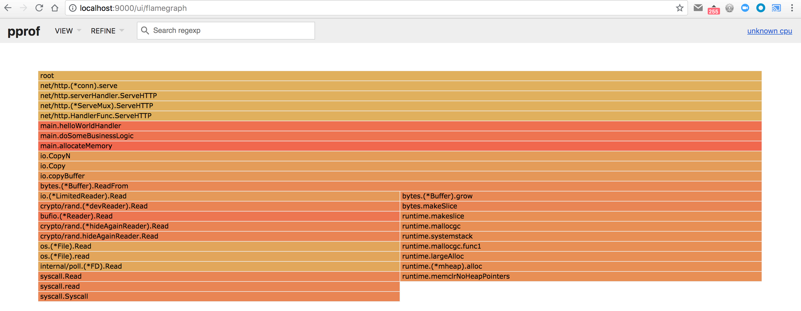
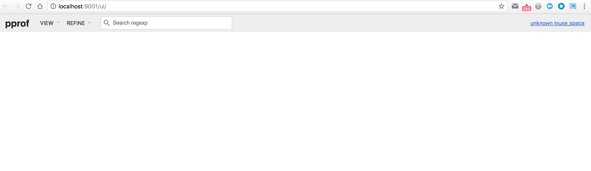
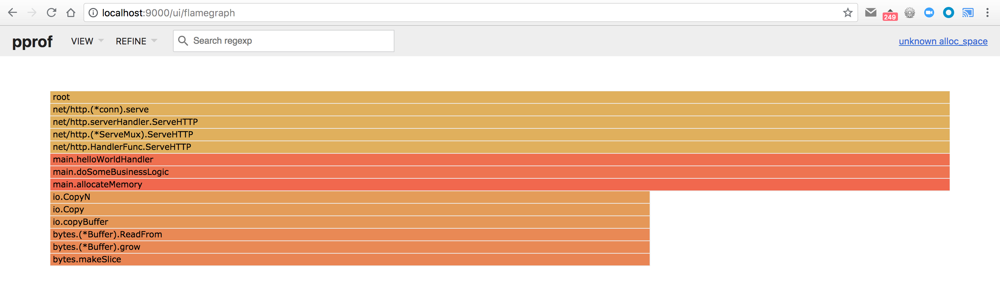
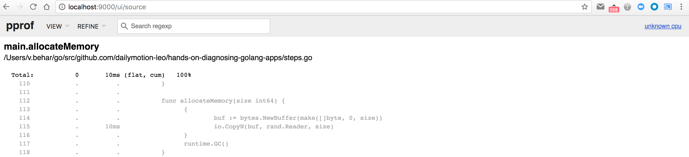
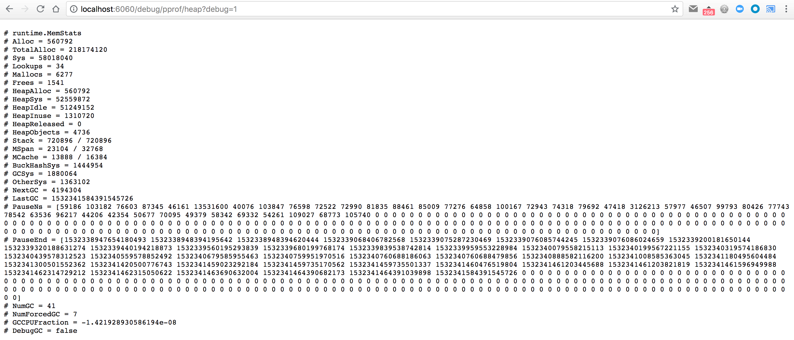

# Step 4

First, make sure you've made a request to [/goto?step=4](http://localhost:6060/goto?step=4) to enable the fourth step:

```
$ curl http://localhost:6060/goto\?step\=4
switched to step 4
```

Same as the other steps, we don't know where to look, so we can start by hitting the main endpoint of our HTTP server, by making an HTTP request on <http://localhost:6060/>:

```
$ curl http://localhost:6060/
hello world
```

This time the endpoint answers slowly, as in the step 3. If we look at the logs, we can see that it took a few hundred milliseconds (which is slower than expected):

```
2018/07/12 15:03:44 Application started with PID 73825
2018/07/12 15:03:44 HTTP server started on :6060
2018/07/12 16:30:47 Starting processing request...
2018/07/12 16:30:47 Request processed in 742.278017ms
```

We can use the same tool as for the previous step: pprof and a CPU profile. Start by requesting a 10 seconds CPU profile:

```
$ pprof -http=:9000 http://localhost:6060/debug/pprof/profile\?seconds\=10
```

And make a new HTTP request with

```
$ curl http://localhost:6060/
```

After 10 seconds, pprof will automatically open your default browser and point it to <http://localhost:9000/ui/>. Let's open our favorite `Flame Graph` view at <http://localhost:9000/ui/flamegraph>:



Once again, we can clearly see that most of the CPU time is spent in `doSomeBusinessLogic` function, and more specifically in the `allocateMemory` function. Let's try not to be influenced by the function name, and see behind it: lots of io-related operations, and a bytes buffer that is growing.

So, it's memory-related. Again. Let's see if a memory heap profile can help us dig deeper. We'll take a heap profile with

```
$ pprof -http=:9001 http://localhost:6060/debug/pprof/heap
```

It will start a new web server on port 9001, open your default browser and point it to <http://localhost:9001/ui/>:



But it's empty. And no, it's not a bug. You can try all the different views, you won't see anything. Because there is nothing to see. And there is nothing to see because our application doesn't hold on any data when we took the heap profile.

That means that our memory issue is scoped to a single HTTP request, and that we have no "leak".

Instead of displaying the "inuse space", let's try to display the "allocated space", using the `-sample_index=alloc_space` flag:

```
$ pprof -sample_index=alloc_space -http=:9001 http://localhost:6060/debug/pprof/heap
```

Great, this time we have something! Let's switch to the `Flame Graph` view, as usual:



So our function is back, and is clearly allocating memory, but it doesn't hold on any. So no "leak". Let's confirm this by opening the `Source` view of the CPU profile at <http://localhost:9000/ui/source>:



We are clearly copying data from a random generator reader, but this time to a temporary buffer, which will be discarded at the end of the function, and the allocated memory will be reclaimed by the garbage collector.

## Different tools we could have used

### ps

Another way to look at it, is to use `ps` - using the PID of the application, which is printed in the application's logs:

```
$ ps l 27065
UID   PID  PPID CPU PRI NI       VSZ    RSS WCHAN  STAT   TT       TIME COMMAND
502 27065 76310   0  31  0 556620496   4316 -      S+   s005    0:00.01 ./hands-on-diagnosing-golang-apps
```

The interesting column to look at is the `RSS` one, which is the `Resident Set Size`. Here, it is `4644 KB`, just after the application startup.

Let's make a few requests, and have a look at the output of `ps` again:

```
$ ps l 27065
UID   PID  PPID CPU PRI NI       VSZ     RSS WCHAN  STAT   TT       TIME COMMAND
502 27065 76310   0  31  0 556627504   46060 -      S+   s005    0:05.24 ./hands-on-diagnosing-golang-apps
```

We can see that the RSS has grown to more than 46 MB. Our first interpretation should be to think that it's a memory leak: the more requests you make, the more the RSS grow. But... it's not that simple.

The `RSS` represents the memory used by the process, from the kernel point-of-view. But our application is a Go application, with an embedded runtime and garbage collector. So, it's time to dig deeper into how the Go runtime manages the memory.

For that, we'll have a look at the memory metrics. There are 2 ways to see them:

- use the heap pprof endpoint in debug mode: <http://localhost:6060/debug/pprof/heap?debug=1>
- use the expvar endpoint: <http://localhost:6060/debug/vars>

The expvar endpoint returns data in the expvar format, which is easy to parse, but not very human-friendly. The heap pprof endpoint returns data in a more human-friendly format, so that's the one we'll use.



We can see a few metrics with the `Heap` prefix. To know the signification of each, we need to check the [Go runtime documentation](https://golang.org/pkg/runtime/):

* **HeapAlloc** is bytes of allocated heap objects.
  > "Allocated" heap objects include all reachable objects, as well as unreachable objects that the garbage collector has not yet freed. Specifically, HeapAlloc increases as heap objects are allocated and decreases as the heap is swept and unreachable objects are freed. Sweeping occurs incrementally between GC cycles, so these two processes occur simultaneously, and as a result HeapAlloc tends to change smoothly (in contrast with the sawtooth that is typical of stop-the-world garbage collectors).
* **HeapSys** is bytes of heap memory obtained from the OS.
  > HeapSys measures the amount of virtual address space reserved for the heap. This includes virtual address space that has been reserved but not yet used, which consumes no physical memory, but tends to be small, as well as virtual address space for which the physical memory has been returned to the OS after it became unused (see HeapReleased for a measure of the latter).

  > HeapSys estimates the largest size the heap has had.
* **HeapIdle** is bytes in idle (unused) spans.
  > Idle spans have no objects in them. These spans could be (and may already have been) returned to the OS, or they can be reused for heap allocations, or they can be reused as stack memory.

  > HeapIdle minus HeapReleased estimates the amount of memory that could be returned to the OS, but is being retained by the runtime so it can grow the heap without requesting more memory from the OS. If this difference is significantly larger than the heap size, it indicates there was a recent transient spike in live heap size.
* **HeapInuse** is bytes in in-use spans.
  > In-use spans have at least one object in them. These spans can only be used for other objects of roughly the same
size.

  > HeapInuse minus HeapAlloc estimates the amount of memory that has been dedicated to particular size classes, but is not currently being used. This is an upper bound on fragmentation, but in general this memory can be reused efficiently.
* **HeapReleased** is bytes of physical memory returned to the OS.
  > This counts heap memory from idle spans that was returned to the OS and has not yet been reacquired for the heap.
* **HeapObjects** is the number of allocated heap objects.
  > Like HeapAlloc, this increases as objects are allocated and decreases as the heap is swept and unreachable objects are freed.

Here, we can see the following values:

```
HeapAlloc = 560792
HeapSys = 52559872
HeapIdle = 51249152
HeapInuse = 1310720
HeapReleased = 0
HeapObjects = 4736
```

We can see that we are only using a little more than 1 MB of data, and we have more than 50 MB of "idle" space. And nothing has been released to the OS. That means that the Go runtime kept hold of the space used by the discarded data, so it doesn't have to release memory to the OS, and then ask for it again.

We can confirm it by doing more HTTP requests, and checking again the output of the `ps` command:

```
$ ps l 27065
UID   PID  PPID CPU PRI NI       VSZ     RSS WCHAN  STAT   TT       TIME COMMAND
502 27065 76310   0  31  0 556627760   39324 -      S+   s005    0:28.58 ./hands-on-diagnosing-golang-apps
```

We can see that the RSS is roughly the same, which confirms that there is no memory leak.

If we want to know how much memory is allocated per HTTP request, we can have a look at the value of `TotalAlloc`, before and after an HTTP request. According to the [Go runtime documentation](https://golang.org/pkg/runtime/):

* **TotalAlloc** is cumulative bytes allocated for heap objects.
  > TotalAlloc increases as heap objects are allocated, but unlike Alloc and HeapAlloc, it does not decrease when objects are freed.
