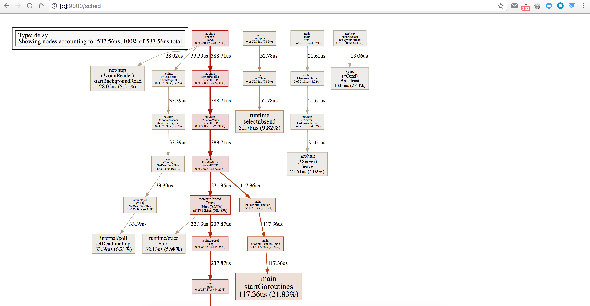
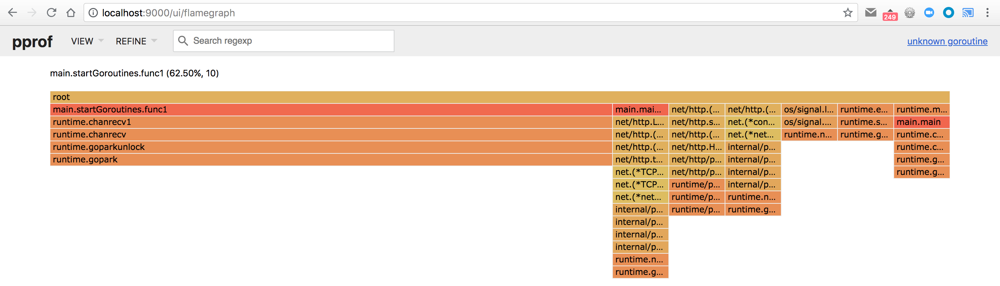
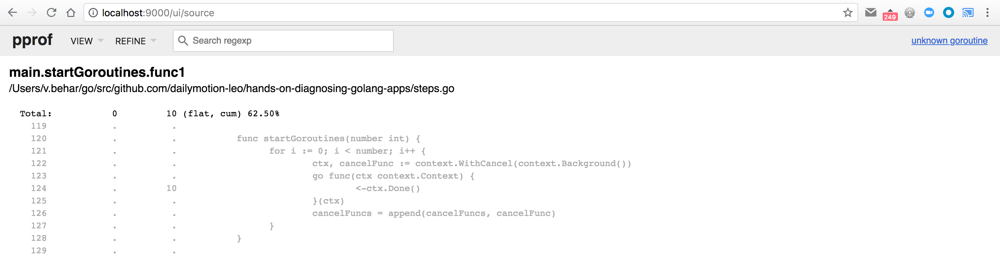

# Step 5

First, make sure you've made a request to [/goto?step=5](http://localhost:6060/goto?step=5) to enable the fifth step:

```
$ curl http://localhost:6060/goto\?step\=5
switched to step 5
```

Same as the other steps, we don't know where to look, so we can start by hitting the main endpoint of our HTTP server, by making an HTTP request on <http://localhost:6060/>:

```
$ curl http://localhost:6060/
hello world
```

This time the endpoint answers quickly. If we look at the logs, we can see that it took a few hundred microseconds:

```
2018/07/12 15:03:44 Application started with PID 73825
2018/07/12 15:03:44 HTTP server started on :6060
2018/07/12 16:30:47 Starting processing request...
2018/07/12 16:30:47 Request processed in 282.63µs
```

So it's fast, but not as fast as it should be. If you remember the "correct" behaviour of the application, it should answer in a few dozens microseconds. So here it takes 10 times the processing time it should take.

If we try to use the same tools we used for the previous steps (CPU and heap profiles), we quickly notice that both are empty:
- the CPU profile is "empty" because the HTTP handler is answering too fast
- the heap profile is "empty" because nothing holds on some data

Let's take a trace of what is happening, if the profiles can't help us. First, we need to collect a trace with

```
$ curl http://localhost:6060/debug/pprof/trace\?seconds\=5 > /tmp/trace.out
```

Then, make a new HTTP request

```
$ curl http://localhost:6060/
```

and use the go trace tool to start a new webserver on port 9000 to analyze the trace:

```
$ go tool trace -http=:9000 /tmp/trace.out
```

It should automatically open your default browser and point it to <http://localhost:9000/>. If you click on the `Scheduler latency profile` link, you will see



Good, this time we can see our `helloWorldHandler` and its friend `doSomeBusinessLogic`. And a new function called `startGoroutines`. It's hard to resist the temptation of saying that maybe this function starts some goroutines, so let's use another tool, and have an overview of what is happening with the list of goroutines, by hitting the pprof endpoint at <http://localhost:6060/debug/pprof/goroutine?debug=2>:

```
goroutine 79 [running]:
runtime/pprof.writeGoroutineStacks(0x13e8560, 0xc4202f4000, 0x4, 0x16742f8)
	/usr/local/opt/go/libexec/src/runtime/pprof/pprof.go:650 +0xa7
runtime/pprof.writeGoroutine(0x13e8560, 0xc4202f4000, 0x2, 0xc420b31000, 0x13e8360)
	/usr/local/opt/go/libexec/src/runtime/pprof/pprof.go:639 +0x44
runtime/pprof.(*Profile).WriteTo(0x1595740, 0x13e8560, 0xc4202f4000, 0x2, 0xc4202f4000, 0x13a6d67)
	/usr/local/opt/go/libexec/src/runtime/pprof/pprof.go:310 +0x3e4
net/http/pprof.handler.ServeHTTP(0xc42001e1f1, 0x9, 0x13eb6c0, 0xc4202f4000, 0xc4202ba000)
	/usr/local/opt/go/libexec/src/net/http/pprof/pprof.go:243 +0x20d
net/http/pprof.Index(0x13eb6c0, 0xc4202f4000, 0xc4202ba000)
	/usr/local/opt/go/libexec/src/net/http/pprof/pprof.go:254 +0x1d1
net/http.HandlerFunc.ServeHTTP(0x13bd7f0, 0x13eb6c0, 0xc4202f4000, 0xc4202ba000)
	/usr/local/opt/go/libexec/src/net/http/server.go:1947 +0x44
net/http.(*ServeMux).ServeHTTP(0x15a2a00, 0x13eb6c0, 0xc4202f4000, 0xc4202ba000)
	/usr/local/opt/go/libexec/src/net/http/server.go:2337 +0x130
net/http.serverHandler.ServeHTTP(0xc42016a000, 0x13eb6c0, 0xc4202f4000, 0xc4202ba000)
	/usr/local/opt/go/libexec/src/net/http/server.go:2694 +0xbc
net/http.(*conn).serve(0xc4200a60a0, 0x13eb9c0, 0xc4200222c0)
	/usr/local/opt/go/libexec/src/net/http/server.go:1830 +0x651
created by net/http.(*Server).Serve
	/usr/local/opt/go/libexec/src/net/http/server.go:2795 +0x27b

goroutine 1 [chan receive, 177 minutes]:
main.main()
	/Users/v.behar/go/src/github.com/dailymotion-leo/hands-on-diagnosing-golang-apps/main.go:43 +0x2a3

goroutine 314 [chan receive, 2 minutes]:
main.startGoroutines.func1(0x13eb9c0, 0xc4202b4140)
	/Users/v.behar/go/src/github.com/dailymotion-leo/hands-on-diagnosing-golang-apps/steps.go:124 +0x48
created by main.startGoroutines
	/Users/v.behar/go/src/github.com/dailymotion-leo/hands-on-diagnosing-golang-apps/steps.go:123 +0x7f

goroutine 315 [chan receive, 2 minutes]:
main.startGoroutines.func1(0x13eb9c0, 0xc4202b4180)
	/Users/v.behar/go/src/github.com/dailymotion-leo/hands-on-diagnosing-golang-apps/steps.go:124 +0x48
created by main.startGoroutines
	/Users/v.behar/go/src/github.com/dailymotion-leo/hands-on-diagnosing-golang-apps/steps.go:123 +0x7f

goroutine 316 [chan receive, 2 minutes]:
main.startGoroutines.func1(0x13eb9c0, 0xc4202b41c0)
	/Users/v.behar/go/src/github.com/dailymotion-leo/hands-on-diagnosing-golang-apps/steps.go:124 +0x48
created by main.startGoroutines
	/Users/v.behar/go/src/github.com/dailymotion-leo/hands-on-diagnosing-golang-apps/steps.go:123 +0x7f

goroutine 317 [chan receive, 2 minutes]:
main.startGoroutines.func1(0x13eb9c0, 0xc4202b4200)
	/Users/v.behar/go/src/github.com/dailymotion-leo/hands-on-diagnosing-golang-apps/steps.go:124 +0x48
created by main.startGoroutines
	/Users/v.behar/go/src/github.com/dailymotion-leo/hands-on-diagnosing-golang-apps/steps.go:123 +0x7f

goroutine 318 [chan receive, 2 minutes]:
main.startGoroutines.func1(0x13eb9c0, 0xc4202b4240)
	/Users/v.behar/go/src/github.com/dailymotion-leo/hands-on-diagnosing-golang-apps/steps.go:124 +0x48
created by main.startGoroutines
	/Users/v.behar/go/src/github.com/dailymotion-leo/hands-on-diagnosing-golang-apps/steps.go:123 +0x7f

[...]
```

Bingo! We can see that we have a few goroutines that look similar, and that are all waiting on a channel (`chan receive`), which means they are waiting for something to happen.

Let's count how many goroutines we have, do a new HTTP request, and count again. After the request we have 5 more goroutines... So this seems like a goroutines leak.

We can also collect and analyze a goroutine profile:

```
$ pprof -http=:9000 http://localhost:6060/debug/pprof/goroutine
```

And then open the `Flame Graph` view:



We can see the `startGoroutines` function, which is linked to 10 goroutines.

And if we open the `Source` view:



We can see that our `startGoroutines` function is starting multiple goroutines, but never stopping them.
