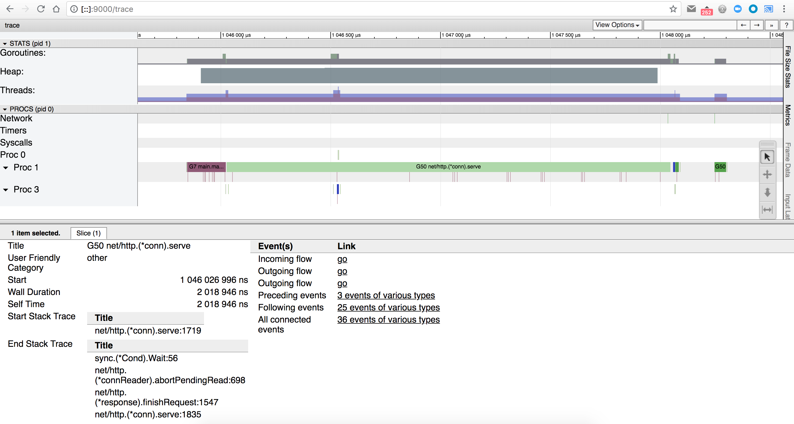

# Step 6

First, make sure you've made a request to [/goto?step=6](http://localhost:6060/goto?step=6) to enable the sixth step:

```
$ curl http://localhost:6060/goto\?step\=6
switched to step 6
```

Same as the other steps, we don't know where to look, so we can start by hitting the main endpoint of our HTTP server, by making an HTTP request on <http://localhost:6060/>:

```
$ curl http://localhost:6060/
hello world
```

This time the endpoint answers quickly. If we look at the logs, we can see that it took a few milliseconds:

```
2018/07/12 15:03:44 Application started with PID 73825
2018/07/12 15:03:44 HTTP server started on :6060
2018/07/12 16:30:47 Starting processing request...
2018/07/12 16:30:47 Request processed in 1.088028ms
```

So it's fast, but again, not as fast as it should be.

If we try to use the same tools we used for the previous steps (CPU and heap profiles), we quickly notice that both are empty:
- the CPU profile is "empty" because the HTTP handler is answering too fast
- the heap profile is "empty" because nothing holds on some data

Let's take a trace of what is happening, if the profiles can't help us. First, we need to collect a trace with

```
$ curl http://localhost:6060/debug/pprof/trace\?seconds\=5 > /tmp/trace.out
```

Then, make a new HTTP request

```
$ curl http://localhost:6060/
```

and use the go trace tool to start a new webserver on port 9000 to analyze the trace:

```
$ go tool trace -http=:9000 /tmp/trace.out
```

It should automatically open your default browser and point it to <http://localhost:9000/>. If you click on the `View trace` link, you will see


Ok, not so much to see here, because the default window is too large. We need to zoom in, around the 1s timeline, using the `w` keyboard key (type `?` to get the keyboard shortcuts, or click on the `?` icon on the top-right). You should be able to see the following by zooming:



That's much more interesting! If we click on the goroutine 50 in our example (`G50`), we can see some information about it in the bottom of the screen. We can see that it has 36 "connected events of various types". Let's click on this link to display these events:


Most of the time is taken by the `G50` goroutine, but that's already what we can see from the graph on top. The interesting part here is the number of `syscall` occurences: **29**. Let's click on the `syscall` link, and then select the `self time` radio input, to see the list of syscalls:


In this screenshot we can only see the first 2 syscalls, but if you scroll down you can see the others. Let's click on a syscall link to open the details. The first 2 syscalls are not very interesting, but the third one is a lot more interesting:


Our `helloWorldHandler` is back, with its friend `doSomeBusinessLogic`. And we can see that it's opening a file, which at the bottom of the stack ends up in a syscall. Let's go back and open a few more syscalls: we have a few more like that.

Let's dig in deeper: we now know that the HTTP handler is opening multiple files. Let's make sure they are closed at the end. To do that, we can use the `lsof` tool, which will **list the open file descriptors**.

To use it, we first need to retrieve the app's PID, which is printed in the app's logs - `74403` in our current example:

```
$ lsof -p 74403
COMMAND     PID    USER   FD     TYPE             DEVICE  SIZE/OFF     NODE NAME
hands-on- 74403 v.behar  cwd      DIR                1,4       612 52631776 /Users/v.behar/go/src/github.com/dailymotion-leo/hands-on-diagnosing-golang-apps
hands-on- 74403 v.behar  txt      REG                1,4   9092204 52895790 /Users/v.behar/go/src/github.com/dailymotion-leo/hands-on-diagnosing-golang-apps/hands-on-diagnosing-golang-apps
hands-on- 74403 v.behar  txt      REG                1,4    697712 43116948 /usr/lib/dyld
hands-on- 74403 v.behar  txt      REG                1,4 662388736 45159126 /private/var/db/dyld/dyld_shared_cache_x86_64h
hands-on- 74403 v.behar    0u     CHR               16,5   0t67404    22195 /dev/ttys005
hands-on- 74403 v.behar    1u     CHR               16,5   0t67404    22195 /dev/ttys005
hands-on- 74403 v.behar    2u     CHR               16,5   0t67404    22195 /dev/ttys005
hands-on- 74403 v.behar    3u    IPv6 0x2df2619c0a72e99f       0t0      TCP *:6060 (LISTEN)
hands-on- 74403 v.behar    4u  KQUEUE                                       count=0, state=0xa
hands-on- 74403 v.behar    6u     REG                1,4         0 53892600 /private/var/folders/v0/fx5l3skn17785d8f4l883m6w0000gp/T/go-app-dir-147796943/go-app-file-497238242
hands-on- 74403 v.behar    7u     REG                1,4         0 53892601 /private/var/folders/v0/fx5l3skn17785d8f4l883m6w0000gp/T/go-app-dir-147796943/go-app-file-199927513
hands-on- 74403 v.behar    8u     REG                1,4         0 53892602 /private/var/folders/v0/fx5l3skn17785d8f4l883m6w0000gp/T/go-app-dir-147796943/go-app-file-449519716
hands-on- 74403 v.behar    9u     REG                1,4         0 53892603 /private/var/folders/v0/fx5l3skn17785d8f4l883m6w0000gp/T/go-app-dir-147796943/go-app-file-516141683
hands-on- 74403 v.behar   10u     REG                1,4         0 53892604 /private/var/folders/v0/fx5l3skn17785d8f4l883m6w0000gp/T/go-app-dir-147796943/go-app-file-850646326
```

We can see a few `REG`ular files opened with both read/write permission (identified as `u` in the `FD` column), in the temporary directory.

Let's make 2 more HTTP requests and see how the output of `lsof` evolves:

```
$ lsof -p 74403
COMMAND     PID    USER   FD     TYPE             DEVICE  SIZE/OFF     NODE NAME
hands-on- 74403 v.behar  cwd      DIR                1,4       612 52631776 /Users/v.behar/go/src/github.com/dailymotion-leo/hands-on-diagnosing-golang-apps
hands-on- 74403 v.behar  txt      REG                1,4   9092204 52895790 /Users/v.behar/go/src/github.com/dailymotion-leo/hands-on-diagnosing-golang-apps/hands-on-diagnosing-golang-apps
hands-on- 74403 v.behar  txt      REG                1,4    697712 43116948 /usr/lib/dyld
hands-on- 74403 v.behar  txt      REG                1,4 662388736 45159126 /private/var/db/dyld/dyld_shared_cache_x86_64h
hands-on- 74403 v.behar    0u     CHR               16,5   0t67404    22195 /dev/ttys005
hands-on- 74403 v.behar    1u     CHR               16,5   0t67404    22195 /dev/ttys005
hands-on- 74403 v.behar    2u     CHR               16,5   0t67404    22195 /dev/ttys005
hands-on- 74403 v.behar    3u    IPv6 0x2df2619c0a72e99f       0t0      TCP *:6060 (LISTEN)
hands-on- 74403 v.behar    4u  KQUEUE                                       count=0, state=0xa
hands-on- 74403 v.behar    6u     REG                1,4         0 53892600 /private/var/folders/v0/fx5l3skn17785d8f4l883m6w0000gp/T/go-app-dir-147796943/go-app-file-497238242
hands-on- 74403 v.behar    7u     REG                1,4         0 53892601 /private/var/folders/v0/fx5l3skn17785d8f4l883m6w0000gp/T/go-app-dir-147796943/go-app-file-199927513
hands-on- 74403 v.behar    8u     REG                1,4         0 53892602 /private/var/folders/v0/fx5l3skn17785d8f4l883m6w0000gp/T/go-app-dir-147796943/go-app-file-449519716
hands-on- 74403 v.behar    9u     REG                1,4         0 53892603 /private/var/folders/v0/fx5l3skn17785d8f4l883m6w0000gp/T/go-app-dir-147796943/go-app-file-516141683
hands-on- 74403 v.behar   10u     REG                1,4         0 53892604 /private/var/folders/v0/fx5l3skn17785d8f4l883m6w0000gp/T/go-app-dir-147796943/go-app-file-850646326
hands-on- 74403 v.behar   12u     REG                1,4         0 53892651 /private/var/folders/v0/fx5l3skn17785d8f4l883m6w0000gp/T/go-app-dir-147796943/go-app-file-221217053
hands-on- 74403 v.behar   13u     REG                1,4         0 53892652 /private/var/folders/v0/fx5l3skn17785d8f4l883m6w0000gp/T/go-app-dir-147796943/go-app-file-732361688
hands-on- 74403 v.behar   14u     REG                1,4         0 53892653 /private/var/folders/v0/fx5l3skn17785d8f4l883m6w0000gp/T/go-app-dir-147796943/go-app-file-288500567
hands-on- 74403 v.behar   15u     REG                1,4         0 53892654 /private/var/folders/v0/fx5l3skn17785d8f4l883m6w0000gp/T/go-app-dir-147796943/go-app-file-421791434
hands-on- 74403 v.behar   16u     REG                1,4         0 53892655 /private/var/folders/v0/fx5l3skn17785d8f4l883m6w0000gp/T/go-app-dir-147796943/go-app-file-111075745
hands-on- 74403 v.behar   17u     REG                1,4         0 53892679 /private/var/folders/v0/fx5l3skn17785d8f4l883m6w0000gp/T/go-app-dir-147796943/go-app-file-659227276
hands-on- 74403 v.behar   18u     REG                1,4         0 53892680 /private/var/folders/v0/fx5l3skn17785d8f4l883m6w0000gp/T/go-app-dir-147796943/go-app-file-949903483
hands-on- 74403 v.behar   19u     REG                1,4         0 53892681 /private/var/folders/v0/fx5l3skn17785d8f4l883m6w0000gp/T/go-app-dir-147796943/go-app-file-733497246
hands-on- 74403 v.behar   20u     REG                1,4         0 53892682 /private/var/folders/v0/fx5l3skn17785d8f4l883m6w0000gp/T/go-app-dir-147796943/go-app-file-128036965
hands-on- 74403 v.behar   21u     REG                1,4         0 53892683 /private/var/folders/v0/fx5l3skn17785d8f4l883m6w0000gp/T/go-app-dir-147796943/go-app-file-379410560
```

Now, instead of 5 open files, we have 15. That means each HTTP request is opening 5 files, but not closing them.

We are in front of a file descriptors leak situation. With enough HTTP requests, at some point the application will run out of file descriptors, and something bad will happen.

What about trying to make something bad happen? We could temporary lower the file descriptors limit, and make some HTTP requests until we hit the limit.

First, check the current file descriptors limit:

```
$ ulimit -n
65536
```

Lower it to something small, but not too small, so that our application can still start ;-)

```
$ ulimit -n 15
```

Restart our application, so that it runs with the new limit:

```
$ ./hands-on-diagnosing-golang-apps
2018/07/24 11:24:31 Application started with PID 76696
2018/07/24 11:24:31 HTTP server started on :6060
```

Switch to the step 6, and send some HTTP requests:

```
$ curl http://localhost:6060/goto\?step\=6
switched to step 6
$ curl http://localhost:6060/
hello world
$ curl http://localhost:6060/
curl: (52) Empty reply from server
```

And in the application's logs, we can see:

```
2018/07/24 11:24:31 Application started with PID 76696
2018/07/24 11:24:31 HTTP server started on :6060
2018/07/24 11:24:40 Starting processing request...
2018/07/24 11:24:40 Request processed in 604.701µs
2018/07/24 11:24:41 Starting processing request...
2018/07/24 11:24:41 http: panic serving [::1]:51552: open /var/folders/v0/fx5l3skn17785d8f4l883m6w0000gp/T/go-app-dir-342600774/go-app-file-516100624: too many open files
goroutine 38 [running]:
net/http.(*conn).serve.func1(0xc420188140)
	/usr/local/opt/go/libexec/src/net/http/server.go:1726 +0xd0
panic(0x1340240, 0xc42014e7b0)
	/usr/local/opt/go/libexec/src/runtime/panic.go:502 +0x229
main.createFiles(0x5)
	/Users/v.behar/go/src/github.com/dailymotion-leo/hands-on-diagnosing-golang-apps/steps.go:141 +0x176
main.doSomeBusinessLogic()
	/Users/v.behar/go/src/github.com/dailymotion-leo/hands-on-diagnosing-golang-apps/steps.go:99 +0xe5
main.helloWorldHandler(0x13eb6e0, 0xc4201961c0, 0xc42018e400)
	/Users/v.behar/go/src/github.com/dailymotion-leo/hands-on-diagnosing-golang-apps/main.go:79 +0xf7
net/http.HandlerFunc.ServeHTTP(0x13bd440, 0x13eb6e0, 0xc4201961c0, 0xc42018e400)
	/usr/local/opt/go/libexec/src/net/http/server.go:1947 +0x44
net/http.(*ServeMux).ServeHTTP(0x15a2a00, 0x13eb6e0, 0xc4201961c0, 0xc42018e400)
	/usr/local/opt/go/libexec/src/net/http/server.go:2337 +0x130
net/http.serverHandler.ServeHTTP(0xc420172000, 0x13eb6e0, 0xc4201961c0, 0xc42018e400)
	/usr/local/opt/go/libexec/src/net/http/server.go:2694 +0xbc
net/http.(*conn).serve(0xc420188140, 0x13eb9e0, 0xc42015a3c0)
	/usr/local/opt/go/libexec/src/net/http/server.go:1830 +0x651
created by net/http.(*Server).Serve
	/usr/local/opt/go/libexec/src/net/http/server.go:2795 +0x27b
```

Clearly, we managed to crash the application by hitting the file descriptors limit.
