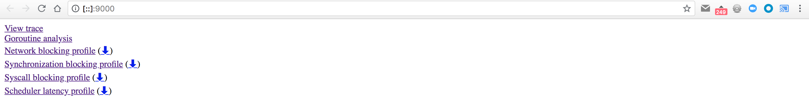
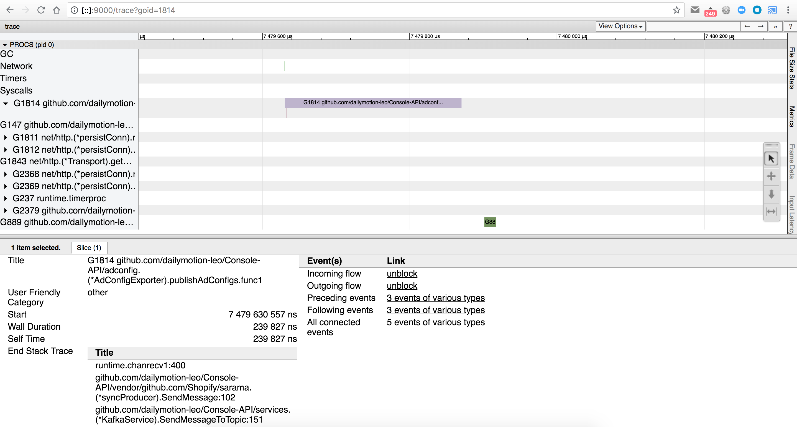

# Analyzing execution traces

Sometimes the CPU profile provided by `pprof` is not enough, and you need to see everything that is happening, not only the most CPU consuming functions.

So it's time for execution traces! Execution traces can be collected from the [pprof HTTP handler](../http-handlers/README.md), and then analyzed with the [trace](https://golang.org/cmd/trace/) tool, provided with Go.

Once you have collected your execution trace, you can start the `trace` tool in HTTP server mode (similar to `pprof`) with:

```
$ go tool trace -http=:9000 /path/to/trace.out
2018/07/27 17:10:04 Parsing trace...
2018/07/27 17:10:04 Serializing trace...
2018/07/27 17:10:04 Splitting trace...
2018/07/27 17:10:04 Opening browser. Trace viewer is listening on http://[::]:9000
```

It will automatically open your default browser and point it to <http://localhost:9000/>:



If you click on the `View trace` link, you can see the details of the execution trace - in our example we took a 20 seconds execution trace:


From top to bottom, we see:
- the number of running goroutines
- the heap size
- the number of active (OS) threads
- the garbage collector executions
- the network operations
- the syscalls
- the details of the running goroutines, per processor

This view contains a LOT of information, and you can zoom in/out with the `w`/`s` keyboard keys to move around and see more details - *hint*: you can use the `?` key (or click on the `?` icon on the top-right of the screen) to see the keyboard shortcuts.

Here is an example of the level of details you can see by zooming in:


We can clearly see the GC (Gargabe Collector) running, its effect on the heap, and all the goroutines running at that time, and what they are doing.

Let's zoom again on 1 specific goroutine, and click on it:


In the bottom of the screen, we can see the stack trace of the goroutine, and all the "events" linked to it. Examples of events are syscalls. You can see them marked as small vertical lines under the `G135` goroutine, in the `Proc 3`. If we click on one, we can see its stack trace again:


You can also get a scoped view by selecting the `Goroutine analysis` link on the main page. It will list the different "types" of goroutines, along with their respective number of occurrence:


Click on one with multiple occurrences, and you can see a list of these occurrences:


Click again on one, will display the trace view scoped only to this goroutine:


Of course we'll need to zoom in, to actually see something:



Here for example, we are sending a Kafka message using Sarama's async func, and we can see the `G889` goroutine (in green in the bottom) which is actually sending the message to the Kafka broker.


There are a few other views:
- network blocking profile
- synchronisation blocking profile
- syscall blocking profile
- scheduler latency profile

that display data using the same "graph" view as the default graph view in pprof.

So the execution trace tool is a great tool to understand when a goroutine starts/stops or what it is doing.

## Resources

- <https://about.sourcegraph.com/go/an-introduction-to-go-tool-trace-rhys-hiltner/>
- <https://golang.org/doc/diagnostics.html>

## Next

You can now get back to the [homepage](../README.md), to start playing with these tools yourself!
